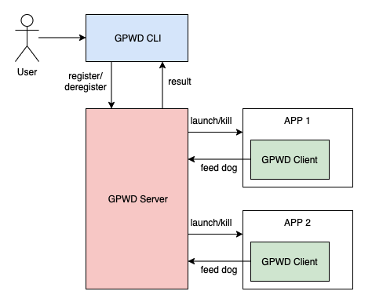

# GPWatchDog
General Purpose Watch Dog

## Main Components



* GPWDServer  
Server that runs in background, responsible for launching new processes, monitor the execution and relaunch when necessary.


* GPWDClient  
Provided as a library with header file `gpwd_client.hpp`.  
User application should initiate the GPWDClient with server ip and port, and then call `GPWDClient::feed()` API regularly to tell the server that it's still functioning correctly.
Usage:
```cpp
GPWDClient client;
client.init("127.0.0.1", 8101); // register to GPWD server
while (1) {
    client.feed();
    // do something else
    // ...
    sleep(1); // sleep for certain time
}
```

* gpwd_cli  
Command-line interface for managing compnents that GPWD should monitor.

```shell
gpwd_cli register --name "my_app1" --executable "/usr/bin/my_app1" --args "['-v', 'abc']" --envs "['CONFIG=./config.json']" --restart_threshold 15 --start_restrain 10

gpwd_clit deregister --name "my_app1"
```


## Use U-Bus as communication middleware
The communication amoung GPWD Server, GPWD Client and CLI is based on U-Bus. GPWD Server is at the same time a U-Bus Server and a U-Bus Participant, while GPWD Client and CLI are all U-Bus Participants.  
The communication protocols amoung these components are transparent to GPWD users.  
Users could benefit from U-Bus CLI for debugging.
